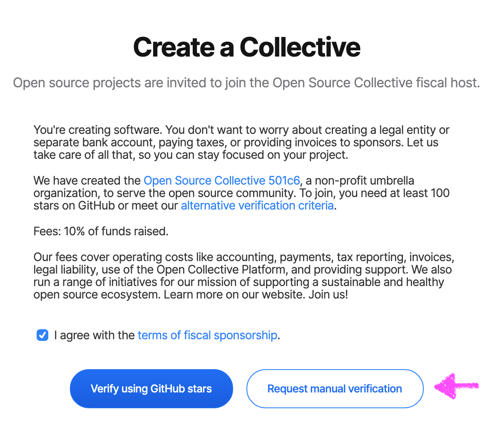

# Manual Verification

If your project is not centred on a Github repository, or you can't get the automated verification system to work, you can request manual verification.

1. Ensure your project meets the [acceptance criteria](acceptance-criteria.md).
2. Go to [https://opencollective.com/opensource/apply](https://opencollective.com/opensource/apply)
3. Agree to the terms of fiscal sponsorship
4. Click 'Request manual verification'
5. Proceed to create your Collective and await manual review

When we review your Collective, we will look at the information you've provided, including links to your website and social media, and the info in your Collective's 'About' section. Please ensure these are up to date and correct on your Collective page.

If we need more information about your project, we will get in touch with you via email to request it.

