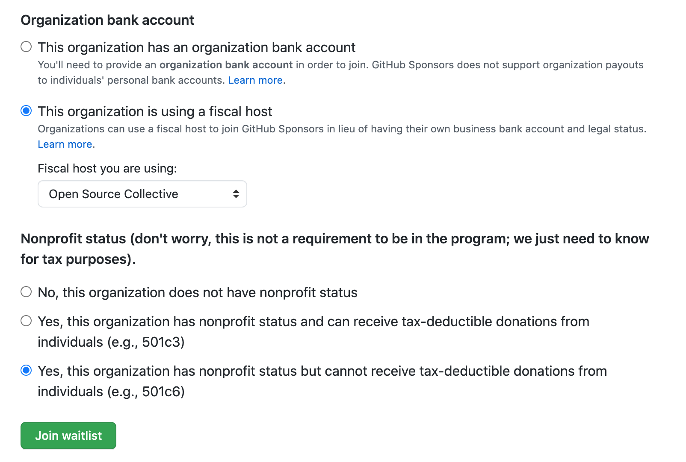
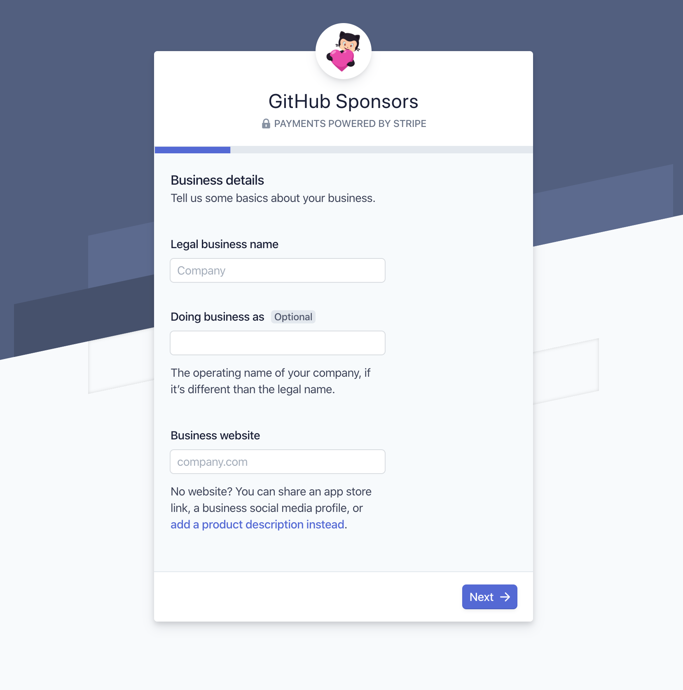
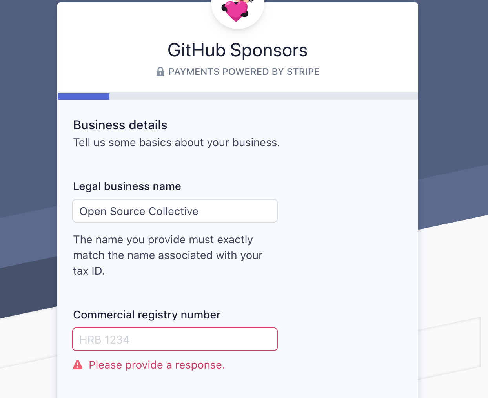

# GitHub Sponsors

Open Source Collective projects can use Open Collective to receive GitHub Sponsors funds by following these steps:

1. Confirm that you have a **GitHub organization** \(not an individual user account\). You can create a GitHub organization by following [this guide](https://help.github.com/en/github/setting-up-and-managing-organizations-and-teams/creating-a-new-organization-from-scratch).
2. [Create a Collective](https://opencollective.com/opensource/apply) for your open source project if you don't already have one. You will need to use Open Source Collective as your fiscal host.   _Note: Open Collective also has a thing called "Organizations" but this is unrelated. You need an Organization on the GitHub side and a Collective on the Open Collective side._ 
3. Visit [github.com/sponsors](http://github.com/sponsors) and sign your Github organization up for the Sponsors waitlist.   ✔️ Select: "This organization is using a fiscal host" and select Open Source Collective from the menu.   ✔️ For non-profit status, answer: “Yes, this organization has nonprofit status but cannot receive tax-deductible donations from individuals \(e.g., 501c6\)”

Click Join Waitlist. GitHub staff will review your application, and you'll be notified when you can proceed to the next step.

## Setting up Stripe Connect

Once your application has been approved by GitHub, you need to connect Open Source Collective's Stripe account by following the below steps.

When you first click on the Stripe Connect account link, you will be taken to a Stripe sign up page.

### Country of operation and contact information

You will be asked to select the country where you legally operate from, or receive payouts in.

As Open Source Collective is a US entity, select **United States**.

Enter **your own phone number and email**, which will be used to verify the account and to send updates.

### Verify your phone number

Next, you will be asked to verify the phone number you gave:

Once the phone number is verified, you will start filling out details about the fiscal host, Open Source Collective.

### Business details \(about Open Source Collective\)

This next section is asking questions about the business. As a Collective fiscally hosted by Open Source Collective, you need to enter OSC’s details here.

* Legal business name: `Open Source Collective`
* Doing business as: `Name of your Collective`
* Business website: `https://opencollective.com/your_collective`

If you are asked for an EIN or "commercial registry number", put in OSC's EIN: **82-2037583**.

### Executive details \(about you\)

Next, you will be filling out details as the acting executive for the Collective. Use your personal information on this page.

The last question on this screen asks for your Social Security number. If you don't have one, click the link to use a different kind of government-issued ID number instead.

### Payout details

Finally, you will input bank account information. Funds you receive through GitHub go to Open Source Collective’s bank account, so they can credit the money to your Collective’s budget on Open Collective.

* Routing number: `123205054`
* Account Number: `4869374308`

After that, you should be all set! ✌️😎

## Frequently Asked Questions

### What fees will be charged?

The standard Open Collective and Open Source Collective fees apply to funds raised via GitHub Sponsors: 10%. GitHub does not charge a fee.

### Should I create an Organization or a Collective?

Confusingly, GitHub and Open Collective use the word "organization" to mean two different things.

* **On GitHub, you need to create an Organization** to use Sponsors for your project.
* **On Open Collective, you need to create a Collective** for your project \(Organizations on Open Collective are a different profile type, for companies who sponsors open source projects, i.e. designed for paying money out, not accepting money like Collectives.

