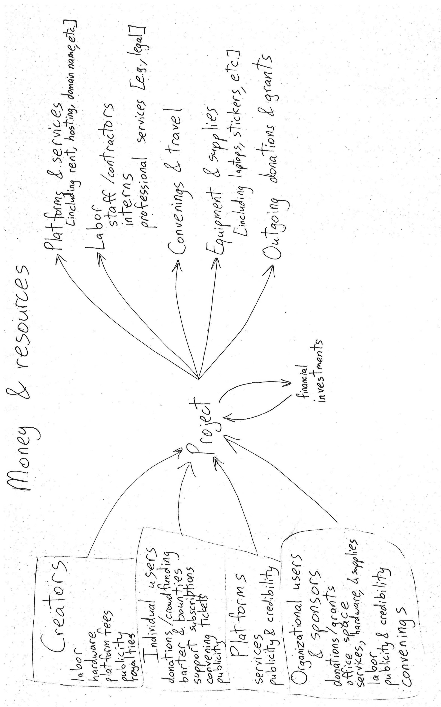

# Recruiting Financial Sponsors

### First, an overview

Here's a diagram describing how money and other resources flow through an open source project. Two key things to notice here:

* money donations from corporate sponsors are one of many ways to get resources (also consider free services from platforms, selling tickets to convenings, etc.)
* there are quite a few things you could spend money on: labor is a huge one, but also consider platform services, equipment, stickers, and more

### Process summary

To recruit financial sponsors, you'll go through this basic sequence:

1. **Inventory:** look at existing donors and make lists of potential donors and fundable tasks or chores&#x20;
2. **Writing:** prepare your requests and update your website and documentation to ensure you look credible&#x20;
3. **Asking:** make the request and follow up on responses

### This may cause you to feel weird

Many of us feel odd about asking for money. It's a good idea to check with yourself if you feeling aversion about it, and work out what you need in order to feel like this is okay. Maybe you have ideological, practical, or psychological barriers.

For example, you may feel a general sense that other people or projects deserve money more than yours does. Try to imagine a friend in your situation and think about whether you would judge that friend for raising money for a similar project, and what justifications you would demand from her.

Or you might feel averse to begging. An alternate way to think about this is that you are offering an opportunity: if the sponsor donates to your project, the project is much more likely to be able to do things that will benefit them. And there's nearly no way for them to figure that out unless you tell them.

Or you might think it's impractical to ask people to pay for something they can use for free. This is why it's useful to come up with and advertise fundable tasks whose completion will benefit your sponsors; they _won't_ be able to use the thing for free, because it won't exist unless someone pays for it.

And remember that it'll get easier as you go; **the first request is hardest**.

### Inventory

#### **1. Write a case study about an existing sponsor.**

_Time: 2-4 hours_

If you have any existing sponsors, then you can develop case studies about their sponsorship. [Here's an example](https://thegnomejournal.wordpress.com/2010/03/30/canonical-upgrading-gnome-bugzilla-and-commercial-sponsorship/]\(https://thegnomejournal.wordpress.com/2010/03/30/canonical-upgrading-gnome-bugzilla-and-commercial-sponsorship/). You don't need a lot of fancy graphics and it can be as short as 4-6 paragraphs. This is a way to demonstrate that your project can effectively turn donations into useful work, and doesn't just sit on them or fritter them away.

Make sure you cover how much money the sponsor gave, what your project used the money for (and over what time period), and how this has benefited the sponsor. You may need to have a short email or phone conversation with someone at the sponsor to find out that last part, but it's important, because having a case study like that on your website makes it easier for a future sponsor to believe that sponsoring you will help them.

#### **2. List potential sponsors.**&#x20;

_Time: 30-60 minutes_

You'll be more likely to be able to attract a sponsor if you can contact a specific human at the company. Look in your messaging archives (the mailing lists, bug tracker, social media) for the names of companies and your contacts at those companies. For example, look for people who have emailed your support mailing list from their work email addresses, or people who have submitted bug reports and mentioned that it's affecting their work.

Sort this list by how much of a relationship you have with that individual person. For instance, if you've ever met them at a conference, had a good experience reviewing their code, or had a good interaction with them on social media or in a chat. The more trust and good feeling you have with a person, the greater the chance they'll champion your request within their company.


This is also a good moment to consider Tidelift as a sponsor aggregator that can fund your project, especially if your project is a library that gets integrated into other software. Look up your package [on Tidelift's site](https://tidelift.com/lifter/search/) to see whether your package is already earning income there.


#### **3. Develop a list of tasks/goals.**

_Time: 4-5 hours_

To attract sponsors, you should be able to explain what tasks or goals would be possible with their funding. Look through your project's TODO list but also be open to more widely imagining things you could do if you could hire people, buy equipment or services, etc. [Here's an example list](https://github.com/psf/fundable-packaging-improvements]\(https://github.com/psf/fundable-packaging-improvements).

A good idea:

* is clearly wanted. There's already consensus among project maintainers, and you aren't waiting for a policy or architecture decision before you can implement it.
* is fairly well-scoped. You can define what success will look like. "Revolutionize e-book lending" is badly scoped; "add this DRM-free lending library to these browser extensions" is well-scoped.
* is fundable: would happen much faster if you got funding to implement the work. So, it has to be legal and physically possible. "Reverse-engineer and re-implement iOS" probably fails this test.
* has a [theory of change](https://www.beautifultrouble.org/toolbox/#/tool/theory-of-change). You have an assessment of what your users' life is like now, a vision of how their lives could be better, and a suggested course of action that would help get closer to that vision.

So, for example, good tasks include:

* get a long-delayed release out
* finish an architectural rewrite that enables features companies want
* add compatibility with an up-and-coming THING
* get a security audit for the first time and good goals that depend on paying people for chores include:
* get "time to first response" for bug reports and patches down from STATISTIC to BETTER STATISTIC
* get release cadence down from CURRENT FREQUENCY to FASTER FREQUENCY
* pay someone to wear a pager for incident response

You may need to do this step in a few passes, coming up with a lot of fresh broad ideas at first, then making them more specific and filtering out ones that don't yet have consensus from your team.

### Writing

#### **1. Choose a few ideas and budget them.**

_Time: 2-3 hours_

To figure out how much money you want to raise from sponsors, start estimating how much time a few of your ideas would take. You may need to talk with your teammates to figure this out, and they may not see the point if they believe they won't have time to implement the idea, even if it's funded. That's okay - if you get funded, you can hire contractors who aren't part of your team already, as long as you budget time to onboard them.

Start with a few of the projects that have smaller scopes. For example, if one of your ideas is to finish rewriting a particular component in your codebase, then probably most of your money will go to wages, and maybe some fraction of it for hardware or similar expenses, and - if we can travel again someday - travel. If you are hiring in the US for skilled Python developers, assume you'll be paying somewhere from $80-$200 dollars per hour. So, let's say you're just paying for labor, $150 an hour. Five weeks at 35 hours per week is 175 hours, and 175 hours at $150 per hour turns into $26,250. So for about $27K you can do this task.

#### **2. Prepare public-facing materials.**

_Time: less than an hour_

When your contact asks their manager for approval to sponsor your project, that manager, or Accounting, will look up your project. Make sure you have the following public-facing webpages prepared so that, if a stranger looks you up, you look credible and legitimate.

On the About page or front page on your website, and in the README of your source code repository, include:

1. A link to your Open Collective profile, so that Accounting knows that the profile pn Open Collective isn't some scammy impersonation.&#x20;
2. A one-paragraph explanation that explains what your project does at a level that managers can understand. Here's a template: FOO is an open source TOOL that DOES THIS THING. It HAS TWO OR THREE KEY FEATURES and thus ALLOWS USERS TO \[ENJOY A KEY BENEFIT]. It is written in LANGUAGE \[for use in FRAMEWORK] and was founded in YEAR."&#x20;
3. Links to your roadmap, if you have one, and to a short list of tasks/goals that need sponsorship. (If you have written any case studies, link to them near these links or on those pages.)

#### **3. Write a sponsorship request letter.**&#x20;

_Time: 30-90 minutes_

You don't need to write a completely new letter for each person you contact; you can develop a template text and then customize it for each contact, perhaps mentioning goals that would particularly benefit them, or times in the past when they've mentioned being interested in helping the project, or (if you know they're already enthusiastic about sponsorship) linking to [resources to help them make the case for sponsorship internally](https://docs.opencollective.com/help/financial-contributors/organizations/sustainer-resources). You can use the example email below as a template. It went to several organizations and was successful in raising money to accelerate a delayed project release.

Since you're with Open Source Collective, you can offer to make things easier for the company's accounting department by registering in their vendor system or sending invoices in advance. [If that's something they want, Open Source Collective can set it up.](https://docs.opencollective.com/help/financial-contributors/organizations/organization-faq#can-we-get-an-invoice-in-advance)

If you have any case studies of past sponsorships, you can link to the most relevant one in this email.

When your contact looks up your Open Collective profile, if they notice that you have more than about a thousand dollars in saved money that you haven't spent in several months, they'll start to wonder whether you really need the sponsorship. You can avoid this situation by usefully spending the money before sending your request. Or, you can in the letter explain what you're about to spend it on, as part of the initiative that needs further funding to succeed.

Example email, sent mid-July 2020:

> Subject: Funding for Autoconf 2.70
>
> I'm part of a small team working to get Autoconf back on track - stable, robust, and making regular releases. Can your company help?
>
> There's lots of code out there already depending on autoconf. Converting it would be risky and expensive. Plus, competing build systems don't cover all the edge cases Autoconf does.
>
> My team has already shipped a beta release of Autoconf 2.70 <[https://lists.gnu.org/archive/html/autotools-announce/2020-07/msg00000.html](https://lists.gnu.org/archive/html/autotools-announce/2020-07/msg00000.html)> and we intend to make the final release in October.
>
> Between now and then, we want to:
>
> * test the upcoming release against emacs, gcc, python, and other complicated autoconf scripts
> * set up proper CI so we can find regressions
> * get the hundreds of disorganized patches and bug reports filed, so we can prioritize and assess our backlog
> * uplift patches that downstream redistributors already carry
> * work with existing maintainers + community to get the project on a more sustainable path
>
> Project manager Sumana Harihareswara (cc'd) and I have detailed plans and availability. But we have bills to pay and need your help.
>
> We already have one sponsor offering $15,000 towards this work - but only if we can find $15K in matching funds from other organizations. If you and two others each give $5,000, we can start the CI work, and we can inventory, migrate, and uplift many long-desired patches. And if we get more funding, we can do even more.
>
> Interested? We want to kick off the work before the end of July. If you can support this effort, let's talk before then and arrange payment.

### Asking

#### **1. Email the request to three contacts**.&#x20;

_Time: 10 minutes_

Don't try contacting all your potential sponsors at once, because then it'll be hard to conduct several conversations at once in case all of them have questions for you. Start with your top three. Since emails asking for money often get spam-filtered, try to let your contacts know via some other medium - such as a social media or chat direct message - that you've sent them an email that might get spam-filtered and that they should look out for that.

#### **2. Respond quickly**.&#x20;

_Time: variable_

If they say yes, great! Try to respond within 2 business days to help them get started.

They may want to fund you through a different mechanism such as Tidelift, at which point your project would need to decide whether to get onto that platform. You may need to deal with a lot of back-and-forths with your contact, their manager, and their accounting department to nudge things forward and to connect them with Open Source Collective to help them through paperwork. Even if it takes 15 back-and-forth steps, remember that it will be finite and that it's worth it.

If they say no, but your contact seems regretful and wishes they could donate money to you, you can ask them for something else that is not money. [Some suggestions: continuous integration services support, or some engineer's or manager's time as secondary mentor for an intern.](https://harihareswara.net/posts/2021/sidestepping-the-pr-bottleneck-four-non-dev-ways-to-support-your-upstreams/) And if they wish they could make the case for sponsorship to their managers, [suggest these resources](https://docs.opencollective.com/help/financial-contributors/organizations/sustainer-resources).

### Repeat

Once you've gone through these steps, you can iterate: picking more contacts to email, developing further fundable ideas, writing case studies, and so on.
