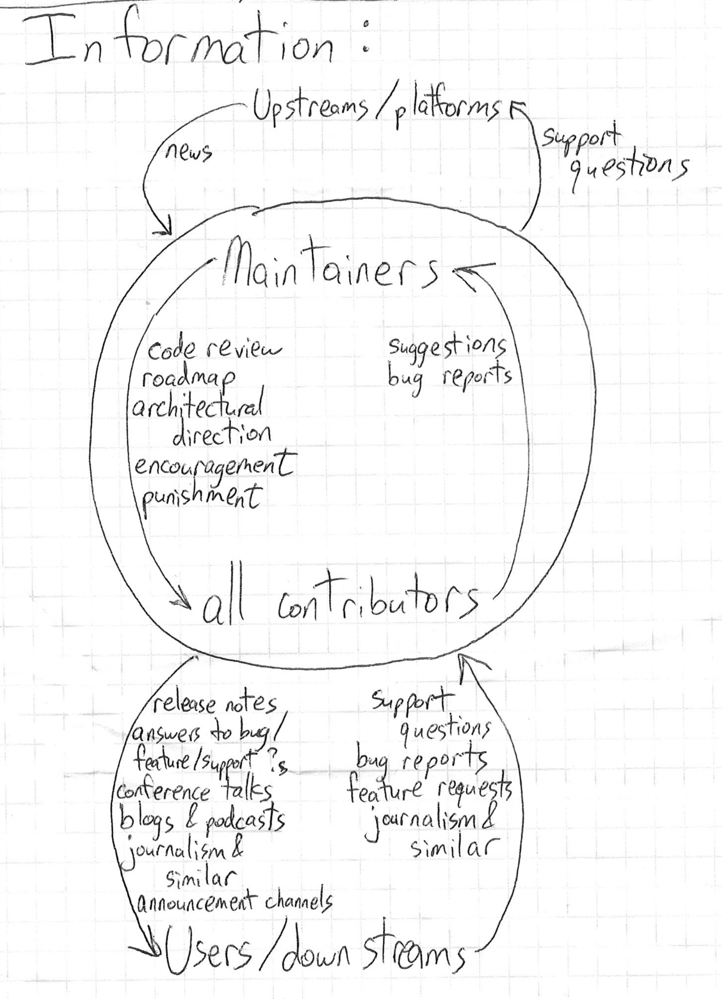
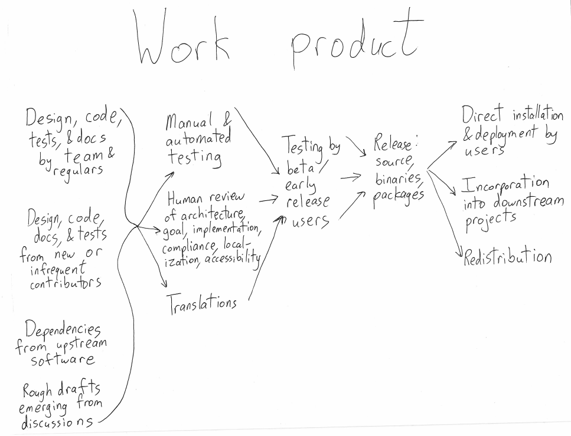

Marketing, publicity, roadmap, and other communications: process and templates

This is a guide based on two Open Source Collective workshops led by Sumana Harihareswara of Changeset Consulting in early 2022. It focuses on writing roadmaps, publicity, marketing, and other communications for OpenCollective-hosted open source software projects.

# Your audiences and what you need to tell them

Your open source project needs to be able to announce stuff to the different groups in this diagram

to ensure they know stuff, and they need to be able to depend on hearing from you about stuff they need to know. Let's mostly concentrate on the kinds of announcements you make to people who aren't already frequent contributors to your project, since that's mostly a different set of activities. So this means talking with, for example,

* your users (individuals, and downstream projects)

* prospective users

* prospective/infrequent contributors

What are the basics you need to write and send out?

1. roadmap: a document or dashboard that conveys the relative priorities of upcoming work, and possibly target dates for releasing near-term work

2. announcements and requests: event-based warnings/brags about or reactions to state changes -- announcements/explanations, requests for help/testing

3. consistent reminders of slow-moving state change/status, such as when you make substantial changes to your roadmap

## Roadmaps

### Why a roadmap?

A roadmap will help your project:

* assess and decide priorities for your team. What are you trying to get out the door next? Is everyone on the same page? Having these articulated makes it easier for people to ask each other to expedite specific tasks, or to make good use of sprints, meetings, and other opportunities. Volunteers can sometimes make commitments when asked, and even if they can't, if everyone knows what the group is trying to prioritize, volunteers are more likely to speak up and alert others when they can't do work others expected of them.

* set expectations for your users/downstreams, for features (e.g. PEPs) they're waiting for, and for deprecations to prepare for.

* say "no" or "not yet" to low-priority requests, and to and the siren songs of yak-shaving.

* keep deprecations in sight, to help lift morale in case you feel like you'll be dragging the old features and their support burden forever!

We make roadmaps to make it easier to decide and share priorities. The process of making a roadmap is a forcing function that helps your team think through:

1. sequencing: "that architectural rewrite is important because x, y, z depend on it"

2. bringing new resources to bear, such as interns, grants, corporate sponsors, and sprints

3. deprecation: when? what? why? (for example, tacking on new support for a new version of the language, and scheduling the deprecation for support of the old version)

Once it exists, a roadmap is one of your communication tools. For example:

* If you make a tool that consulting agencies reuse, and they ask "how can I do x," "why can't I do x," or "when will you release a version that includes feature x?" then you can tell them. Even if you can't pin it down to a date range, telling them "minor release +1" helps them set expectations.

* If downstream packages use your project as a dependency, you can use a roadmap to help them set deprecation expectations. One project in this position made an LTS (Long-Term Support) release. In response to feedback that their deprecations were too fast to keep up with, the project instituted a deprecation policy for their quarterly releases: a deprecation notice would start two release cycles before feature removal, giving downstreams a 6-month head start to adapt. The roadmap is part of the team's effort to be proactive, including warning messages and detailed release notes indicating "feature x will be removed, so if you're using it, change your workflow in the next 6 months."

Similarly, while you can always expect to get support queries about your choice to deprecate functionality, a strategy like [the pip development process and deprecation policy](https://pip.pypa.io/en/stable/development/release-process/) helps cut down on queries and helps you answer them concisely.

### You can start small

You can develop a roadmap slowly and thoroughly, with rounds of revision from all the contributors, laying out changes coming in the next several releases and writing a schedule of expected release dates. That's hard -- it's hard even for software projects where all the contributors are paid, by the same employer, to achieve that roadmap!

It's probably better to start with a quick, rough document laying out three goals:

1. what we're working on for this release
2. what we aim to do in the next release
3. later/after that

Once you have that, a good next step is to write down and publish your current release and/or deprecation process, even if it's as informal as "when one of the maintainers decides it's time for a new release, they package up whatever is on the main branch, and we may unpredictably remove any functionality or interface with no deprecation warning." This sets expectations for your users so they can stay prepared. If you have a deprecation policy, consider tying it to feature freezes a few weeks ahead of each release, to help you confirm and set expectations about what will be in each release. When you make releases, or decide on themes or overarching goals for your releases, make sure you consider whether there's anything you'd like to start deprecating, so you can give users the appropriate notice period.

Sometimes a roadmap is a document, but sometimes a dashboard can serve as a substitute. For example, one project uses GitHub issue milestones as a roadmap, bucketing tasks into "Current release series", then "+1", then "+2". Most of their users are not developers and aren't looking at GitHub, and are more likely to read blog post or corporate-style communications. In contrast, one project whose users are mostly marketers finds that they don't usually visit GitHub. A contributor has started gathering work plans and commitments from contributor companies. Instead of writing it in a document (which often sets unrealistic expectations for schedule certainty), they spoke about those priorities in a conference talk, framing the information as "here's what we are going to concentrate on" rather than making promises. (If you have users like this, you might even want to [offer them a different way to take feature requests, outside of GitHub or your main collaboration platform](https://harihareswara.net/posts/2017/inclusive-or-hospitality-in-bug-tracking/), such as a forum or a live videocall; sometimes having a different medium is helpful!)

And different projects at different life stages need different things from their roadmaps; check out [the Mozilla/Open Tech Strategies project archetypes](https://blog.mozilla.org/wp-content/uploads/2018/05/MZOTS\_OS\_Archetypes\_report\_ext\_scr.pdf) to consider how the development lifecycle differs depending on how many different institutions are involved, and so on. A hobbyist project ([a "houseplant" in OTS's lexicon](https://github.com/OpenTechStrategies/open-source-archetypes/blob/master/arch-houseplant.ltx) might only need a one-line disclaimer that there's no set roadmap at all.

## Announcements and requests

Consider this diagram as you think about the work your team does that needs to get publicized to others:

How do you communicate to your users, upstreams, and other interested people about new releases, new features, deprecations, and so on? How do you get users to take note?

Some approaches are:

* A mailing list. [Here's an example post from the PyPI project](https://mail.python.org/archives/list/pypi-announce@python.org/message/YTZWD5H4H3VCQTQVPRDLH2TTHVTJS7JQ/) that links to a longer "how to test this" document [example](https://wiki.python.org/psf/WarehousePackageMaintainerTesting) hosted on a wiki. It's easier to get users to sign up for an announcement mailing list/newsletter ([example for Python's package repository](https://mail.python.org/mailman3/lists/pypi-announce.python.org/)) if you commit to a very low frequency of posts, such as 2-10 per year.

* A blog sharing regular overviews of new features and fixes. For example, the Dreamwidth project does a regular ["code tour"](https://dw-dev.dreamwidth.org/104915.html) -- [here's how and why it works](https://harihareswara.net/posts/2011/discovering-an-origin/) and [here's how to write one](https://wiki.dreamwidth.net/wiki/index.php/How\_to\_do\_a\_Code\_Tour). Another example: a [Python version release announcement](https://blog.python.org/2021/10/python-3100-is-available.html) or [an announcement of a new feature in PyPI](https://blog.python.org/2019/06/pypi-now-supports-two-factor-login-via.html).

* In-application notifications. If you have a way to feed text notifications for users into your applications, consider judiciously using them. For instance, one project implemented a warning system via in-app instructions, console message logs, and GUI window messages to alert users that features they were using would be deprecated if no one stepped up to maintain them.

* Communicating personally or manually to particular important people and groups. You might keep a checklist of newsletters, podcasts, industry journalists, your liaisons in related projects or organizations, Slacks and Discords, relevant subreddits, your sponsors, etc. and then personally contact them via public posts, Twitter or Discord direct message, SMS/Signal, email, or some other personal mode of contact. For example, see below for an example "Dear sponsor" email the Python Software Foundation sent its sponsors to alert them of an upcoming change to Python packaging tooling.

Your checklist will grow organically over time, like a FAQ page. When users complain that "I didn't know this was happening," ask them: "where do you look for your news?" and build your list from there. Tune your communications to your audience and check every six months or so to learn what to add or discard; some users depend on new platforms. It's always going to be useful to have a single canonical blog post or mailing list post people can point to for the authoritative announcement, but you'll find ways of publicizing that post that reach more and more of your users over time.

## Reminders

In between major announcements, you may want to send consistent reminders of slow-moving state change/status, such as when you make substantial changes to your roadmap. You might also celebrate when people go from Contributor to Maintainer, and commemmorate when they go from Maintainer to Emeritus, [as Guix did](https://guix.gnu.org/en/blog/2022/gnu-guix-maintainer-rotation/), or discuss your principles and vision of your project's future, [as Zulip did](https://blog.zulip.com/2021/12/17/why-zulip-will-stand-the-test-of-time/).

Try to bundle these into low-frequency posts or emails, perhaps quarterly. More than four times a year will start verging on spammy for most users.

## Discoverability outreach

If you have time, and especially if you maintain a complex and widely-used tool, you should also do discoverability outreach, which is finding and bring in stakeholders who don't already participate in your communication spaces, and helping them discover the features you already have and the workflows you already support.

Those tasks might involve branching out to more media -- asking your marketing squad to talk about it in [blog posts](http://akaptur.com/blog/2012/12/18/git-add-p-the-wave-of-the-future/), [videos](https://techcommunity.microsoft.com/t5/microsoft-mvp-award-program-blog/excel-influencer-teaching-the-tiktok-masses/ba-p/2528492), podcasts, conference talks, [zines](http://harihareswara.net/posts/2016/new-zine-playing-with-python-two-of-my-favorite-lenses/), etc. For example, the pip team [scripted, filmed, edited, and published a two-minute video to announce major changes to pip](https://youtu.be/B4GQCBBsuNU) and encourage users to reach out with feedback.

### Sample Dear Sponsor letter

Subject: Dear sponsor: your engineers should test this major Python change by 9/30

Dear \[sponsor\],

Thank you for supporting the Python community. We appreciate your past and future contributions to our community and wanted to take this opportunity to give your team a heads up regarding important changes to a core piece of Python tooling. The de facto tool for installing Python dependencies, pip, has been the focus of a long term funded project to update and improve a core piece of its functionality.

Please forward this email to your software engineering lead or developer as soon as possible! It will help your team make a smoother transition and provide invaluable feedback to the project ahead of launch!

The pip maintainers have just released version 20.2, which includes a beta of the next-generation dependency resolver. It is significantly stricter and more consistent when it receives incompatible instructions, and reduces support for certain kinds of constraints files, so some workarounds and workflows may break. Please test it with the `--use-feature=2020-resolver` flag.

Please test the beta resolver in your developer environments this month. We plan to make pip's next quarterly release, 20.3, next month, in October 2020. We are preparing to change the default dependency resolution behavior and make the new resolver the default in pip 20.3. To prevent major breakage, we need your feedback and bug reports by the end of September.

The new dependency resolver is *off by default* because it is *not yet ready for everyday use.*

Our guide on how to test and migrate:

[https://pip.pypa.io/en/latest/user\_guide/#changes-to-the-pip-dependency-resolver-in-20-2-2020](https://pip.pypa.io/en/latest/user\_guide/#changes-to-the-pip-dependency-resolver-in-20-2-2020)

File bugs and give us feedback using this survey:

[https://tools.simplysecure.org/survey/index.php?r=survey/index\&sid=989272\&lang=en](https://tools.simplysecure.org/survey/index.php?r=survey/index\&sid=989272\&lang=en)

For release highlights and thank-yous to our project funders, see

[https://blog.python.org/2020/07/upgrade-pip-20-2-changes-20-3.html](https://blog.python.org/2020/07/upgrade-pip-20-2-changes-20-3.html) . The full changelog is at [https://pip.pypa.io/en/stable/news/](https://pip.pypa.io/en/stable/news/) .

We also have a special opportunity for you to sign up for our user experience studies, so you can help us shape the future of Python packaging: [http://bit.ly/pip-ux-recruitment-sign-up](http://bit.ly/pip-ux-recruitment-sign-up)

Thank you again,

\[name\]

Python Software Foundation

P.S. For future pip announcements, please subscribe to [https://mail.python.org/archives/list/pypi-announce@python.org/](https://mail.python.org/archives/list/pypi-announce@python.org/) , our low-traffic announcement list.

## A sample schedule for ongoing communications

Assuming your project makes 4 releases per year, here's a sample schedule you could use to plan your ongoing outwards communications.

* 1 month before release:

     ** send/post "how to test this" to the beta testing enthusiasts wherever they are

* 1 week before release:

     ** prepare FAQ and saved replies for bug triage/user support folks
     ** release notes

* at release:

     ** announcement email/blog post
     ** send to relevant newsletters and podcasts
     ** post to subreddits/Discords/Slacks/Zulip/IRC
     ** possibly do livechats
     ** social media posts

* one month after release:

     ** find people talking about the upgrade \& boost them
     ** post a quarterly update about roadmap, releases, finance, maintainer promotions, first-time contributors, good first bugs

